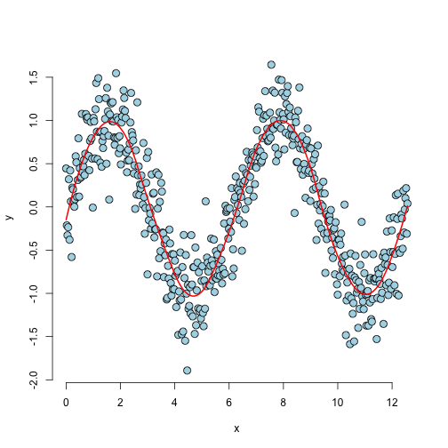

## What is a spline?

A good question.  It is a piecewise (usually polynomial) function used to fit a continuous function through complex data, instead of using a single high-order polynomial function.

A spline is fit between sets of points called "knots", with a line or low-order polynomial being fit through each incremental pair of knot points.

---

## An example spline

Here's what it looks like:

 

--- .class #id 

## The Experiment

### What are our variables?
- Time slice length $t$
- Number of knot points $n$

### What is our outcome?
- A prediction model trained on historical (or simulated) data for a specific combination of time slice length and number of knots

### What is our objective?
- To obtain optimal tradeoff between accuracy of predictive model (accuracy in terms of predicting the coords of the nth knot point in the next time slice), and computation time requirements

---

## Why would we ever want to do this?

This could potentially have application in something like HFT, where a decently accurate prediction of a small incremental move in a security price, executed many times, could (possibly significantly) beat larger batch trades made on much more widely-spaced increments.

Alternatively, it could yield absolutely nothing of practical use, hence experimentation to see if it might!
